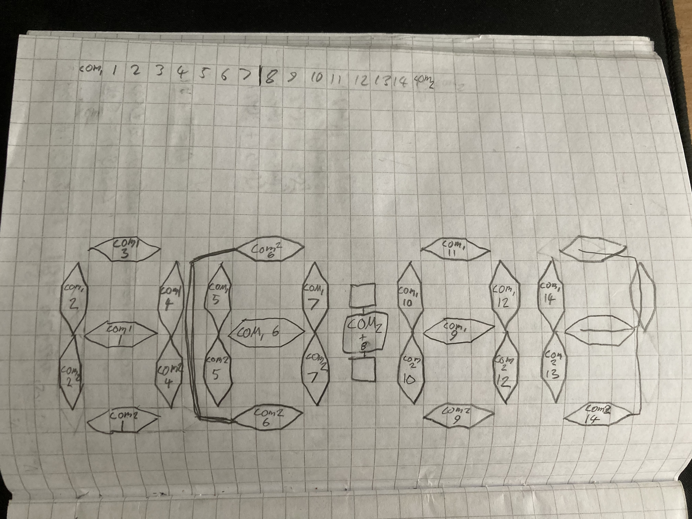
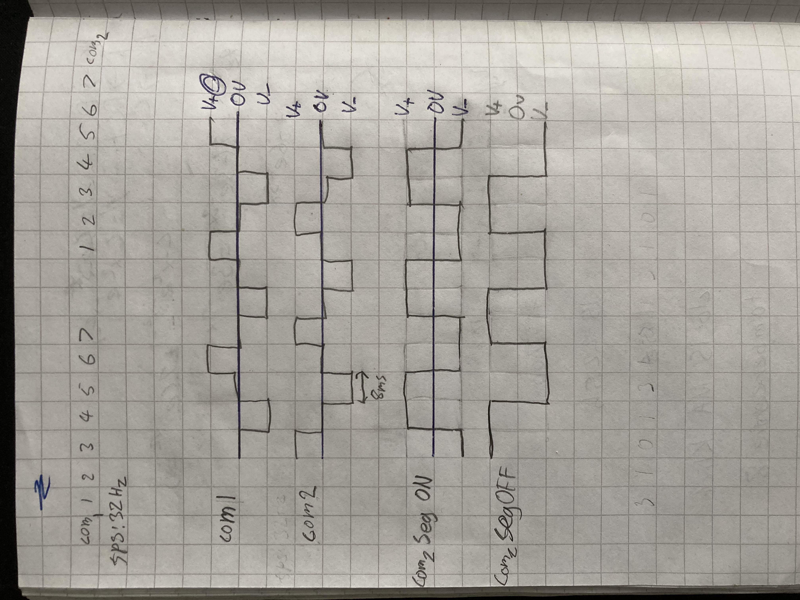
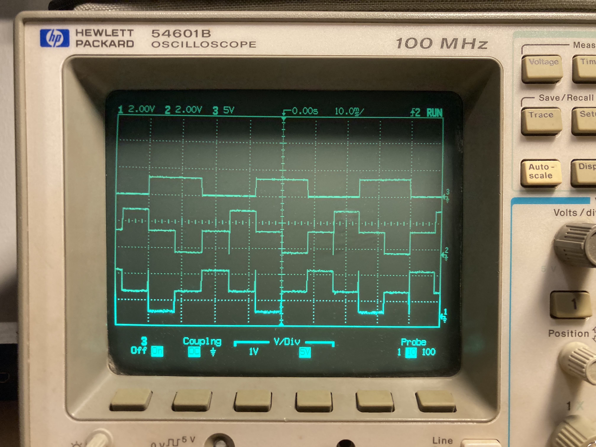

I have owned many cheaply made projector clocks but all of them would lose multiple minutes in just a few months and setting time on them was a pain in the ass. A sane person would probably just deal with it, but I decided to build my own projector clock that could automatically sync time over wifi.

This project was a great opportuntiy to learn about direct driving a lcd screens and multiplexing. 

First digit can only display 1 or 2 and third digit cannot display 0 or 7.

LCD properties: bias 1/2, duty 1/2, fps 32

Scope shot of com 1 + seg and com 2 + seg being active.
